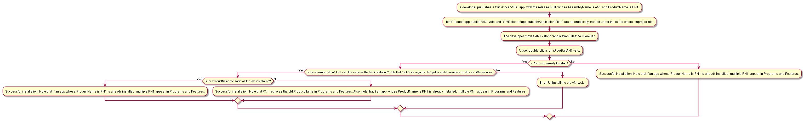

# Publish URL and Install URL

## Publish URL
* Required
* Where a ClickOnce app is generated.
* The Publish URL will not be inserted into the manifest, so it is safe to specify a temporary directory as Publish URL.

## Install URL
* Optional but required if the application needs to be updated and users cannot access the Publish URL.
* Where users automatically check the update of their installed ClickOnce application.

## When Install URL is required
1. Let's say you deploy your ClickOnce application in your local folder, and then move it to a web server at "\\example.com\ClickOnceApplication1"
2. If users can access "\\example.com\ClickOnceApplication1", the Install URL can be omitted because users can get the update from the UNC path.
3. If users cannot access "\\example.com\ClickOnceApplication1" as the SMB port (TCP/445) is closed for them but can access it via the HTTP port (TCP/80), the HTTP URL such as "http://example.com/ClickOnceApplication1" needs to be set in the Install URL.

# AbsoluteUri v.s. AbsolutePath
* Use `AbsoluteUri` rather than `AbsolutePath` because the latter excludes the host name. (//Foo/Bar/Baz.txt vs /Bar/Baz.txt)
* [AbsoluteUri](https://docs.microsoft.com/dotnet/api/system.uri.absoluteuri)
* [AbsolutePath](https://docs.microsoft.com/dotnet/api/system.uri.absolutepath)

# Deployment manifest and application manifest
Manifest|File name
---|---
Deployment manifest|Application1.application
Application manifest|Application1.exe.manifest

# Deployment prerequisites and bootstrapper (setup.exe)
* Bootstrapper (`setup.exe`) is created when there is any prerequisite.
  * [Application deployment prerequisites](https://docs.microsoft.com/visualstudio/deployment/application-deployment-prerequisites)
* When `setup.exe` exists and any of prerequisites is not installed, run `setup.exe` rather than `Application1.application` as the former runs the latter.

# How to delete online ClickOnce application cache
```batch
rundll32 dfshim CleanOnlineAppCache
```

# ClickOnce VSTO application
## How to install a ClickOnce VSTO application
Don't add `/s` because `/s` shows a trust prompt in most cases, which prevents automatic installs.
```batch
VSTOInstaller.exe /i <FilePath or URL>
```

## How to uninstall a ClickOnce VSTO application
```batch
VSTOInstaller.exe /u /s <FilePath or URL>
```

# TODO if you have already made changes to your application manifest file (.manifest)
```batch
cd <manifests dictionary>

rem Sign the application manifest.
mage -s Application1.manifest -cf Certificate1.pfx

rem Sign the master deployment manifest.
mage -u ..\..\Application1.application -appm Application1.exe.manifest -cf Certificate1.pfx

rem Copy the master deployment manifest to the version deployment manifest.
copy /b /y ..\..\Application1.application Application1.application
```

# Why sign the ClickOnce manifests
How to publish a ClickOnce application|Users can verify the publisher?|Users can ensure that the publication was done by the publisher of the previous publication?|Users can verify that the code hasn't been tampered with since its publication?
---|---|---|---
Without any certificate|False|False|False
With a self-generated certificate (analogous to unregistered seals in Japan)|False|True|True
With a CA(Certificate Authority)-verified certificate (analogous to registered seals in Japan)|True|True|True

# ClickOnce VSTO app publishing and installation diagram


## References 
* [How to: Specify the Location Where End Users Will Install From](https://docs.microsoft.com/en-us/visualstudio/deployment/how-to-specify-the-location-where-end-users-will-install-from)
* [ClickOnce Publish Version](https://docs.microsoft.com/en-us/visualstudio/deployment/how-to-set-the-clickonce-publish-version)
* [Building ClickOnce Applications from the Command Line](https://docs.microsoft.com/en-us/visualstudio/deployment/building-clickonce-applications-from-the-command-line)
* [VSTOInstaller.exe](https://msdn.microsoft.com/en-us/library/bb772078.aspx)
* [Mage.exe](https://docs.microsoft.com/en-us/dotnet/framework/tools/mage-exe-manifest-generation-and-editing-tool)
* [MageUI.exe](https://docs.microsoft.com/en-us/dotnet/framework/tools/mageui-exe-manifest-generation-and-editing-tool-graphical-client)
