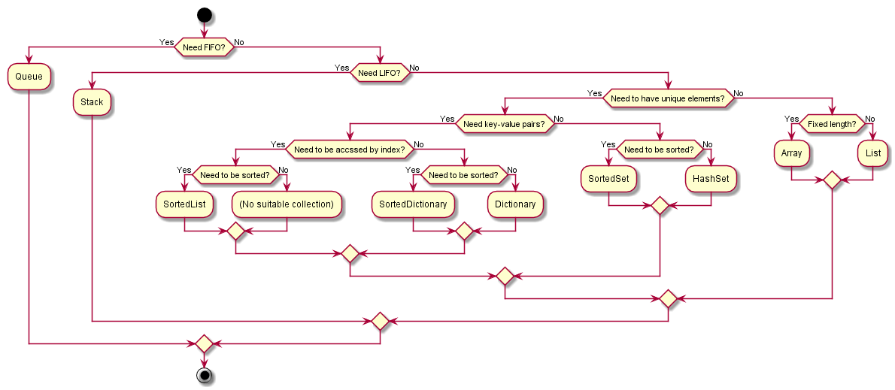

[](https://ci.appveyor.com/project/tatsuya/csharp-cheat-sheet)

# Markdowns
* [NuGet.md](Markdown/NuGet.md)
* [AppDomain.md](Markdown/AppDomain.md)
* [ClickOnce.md](Markdown/ClickOnce.md)
* [EntityFramework.md](Markdown/EntityFramework.md)
* [Threading.md](Markdown/Threading.md)
* [Word.md](Markdown/Word.md)

# Best practices for settings
* Project > `Properties` > `Build` > `Treat warnings as errors` > `All`
* Set `Output type` to `Windows Application` if you don't need Console.
* Suppress Code Analysis warnings by using the `SuppressMessage` attribute and don't use `GlobalSuppressions.cs` because it refers to warned methods by string and cannot keep track of the methods after they are renamed.
```csharp
[SuppressMessage("Microsoft.Usage", "CA2202")]
```
* Don't use ILMerge does not support the latest .NET Framework.

# Best practices for coding
* [Framework Design Guidelines](https://docs.microsoft.com/dotnet/standard/design-guidelines/index)
* [C# Coding Conventions](https://docs.microsoft.com/en-us/dotnet/csharp/programming-guide/inside-a-program/coding-conventions)
* [Best Practices for Using Strings in .NET](https://docs.microsoft.com/dotnet/standard/base-types/best-practices-strings)
* [Managed Threading Best Practices](https://docs.microsoft.com/en-us/dotnet/standard/threading/managed-threading-best-practices)
* [Microsoft REST API Guidelines](https://github.com/Microsoft/api-guidelines)
* [Best practices for exceptions](https://docs.microsoft.com/en-us/dotnet/standard/exceptions/best-practices-for-exceptions)
* [Error Message Guidelines](https://msdn.microsoft.com/library/windows/desktop/ms679325.aspx)
* Mark a class `static` by default. If a class has to not to be `static`, `seal` it.
* Use `int.Parse` if a parsed object is string because `int.Parse` is faster than `Convert.ToInt32`.
* Use `Array.BinarySearch(...)` or `List.BinarySearch(...)` if the array or the list is sorted.
* Specify an initial size in the constructor of a collection if the size is known.
* `throw new InvalidEnumArgumentException(nameof(x), (int)x, typeof(Enum1))` in the default section of `switch` statement if an input is enum.
* `throw new ArgumentOutOfRangeException(nameof(x), x, "Must be foo or bar.")` in the default section of `switch` statement if an input is not enum.
* Don't write parentheses of `catch` if you don't need the information of the thrown exception.
* A rather than B
  * Use `<` and `<=` for readability rather than `>` and `>=`.
  * Use fields rather than auto-implemented properties for simplicity.
  * Use `ToList()` rather than `ToArray()` unless the size is pre-fixed.
  * Use `string.Concat(ss)` rather than `string.Join("", ss)`.
  * The following tells when to use `'+'`, `string.Concat(...)`, or string interpolation without formatting.
    1. If two strings are concatenated, use `'+'`. For example, `{var} + {var2}`.
    2. If more than two strings are concatenated using one or zero string literal, use `string.Concat(...)`. For example, `string.Concat(var1, var2, var3)` or `string.Concat(var1, "foo", var2)`.
    3. Otherwise, use string interpolation. For example, `$"foo{var1}bar{var2}"`.
  * Use `ValueTuple` rather than `Tuple`.
  * Use `ValueTuple.Create(...)` rather than `new ValueType(...)`.
  * Use `xs.GetRange(skipCount, takeCount)` rather than `xs.Skip(skipCount).Take(takeCount)`
  * Use `struct` rather than `static class` as a key of `Dictionary` because `static class` is a reference type and you will accidentally compare addresses of the heap.

# Best practices for logging
* Use log4net rather than EventSource and TraceSource though they are more modern approaches because EventSource is not handy and TraceSource cannot format timestamp and cannot roll log files.

# Environment
```csharp
Environment.CurrentDirectory
Environment.MachineName
Environment.NewLine
Environment.OSVersion
Environment.UserDomainName
Environment.UserName
Environment.Version // Unreliable

Environment.GetFolderPath(Environment.SpecialFolder.ApplicationData)
Environment.GetFolderPath(Environment.SpecialFolder.Desktop)
Environment.GetFolderPath(Environment.SpecialFolder.LocalApplicationData)
Environment.GetFolderPath(Environment.SpecialFolder.UserProfile)
```
## References
* [Environment Class](https://docs.microsoft.com/en-us/dotnet/api/system.environment)
* [Environment.SpecialFolder Enum](https://docs.microsoft.com/en-us/dotnet/api/system.environment.specialfolder)

# Regex
* [Regular Expression Language - Quick Reference](https://docs.microsoft.com/dotnet/standard/base-types/regular-expression-language-quick-reference)

# AssemblyInfo
* [Assembly Versioning](https://docs.microsoft.com/dotnet/framework/app-domains/assembly-versioning)
* Use "yyyy.m.d.*" as AssemblyVersion to automatically increment the revision number
  * yyyy.m.d is a release date, which needs to be manually maintained
* By Omitting AssemblyFileVersion, AssemblyFileVersion implicitly mirrors AssemblyVersion

# Debug
* [Debug.Print (string message)](https://docs.microsoft.com/en-us/dotnet/api/system.diagnostics.debug.print#System_Diagnostics_Debug_Print_System_String_)
* [Debug.Assert (bool condition, string message)](https://docs.microsoft.com/en-us/dotnet/api/system.diagnostics.debug.assert#System_Diagnostics_Debug_Assert_System_Boolean_System_String_)
* [Debug.WriteLine (string message, string category)](https://docs.microsoft.com/en-us/dotnet/api/system.diagnostics.debug.writeline#System_Diagnostics_Debug_WriteLine_System_String_System_String_)
* [Debug.WriteLineIf (bool condition, string message, string category)](https://docs.microsoft.com/en-us/dotnet/api/system.diagnostics.debug.writelineif#System_Diagnostics_Debug_WriteLineIf_System_Boolean_System_String_System_String_)

```csharp
Debug.WriteLine(var1, System.Reflection.MethodBase.GetCurrentMethod().Name);
Debug.WriteLine(var1, nameof(var1));
```

## `-debug:full` and `-debug:pdbonly`
### Benefit of `pdbonly` in release mode
When an exception occurs, `.pdb` shows a stack trace that tells which method of which class on which line of which file failed. However, some of the info is lost if optimized.

### Difference between `full` has and `pdbonly`
||Shows stack trace when exception occurs|Can attach debugger|Impact on performance|
|---|---|---|---|
|`full`|True|True|True|
|`pdbonly`|True|False|False|

### References
* [-debug (C# Compiler Options)](https://docs.microsoft.com/en-us/dotnet/csharp/language-reference/compiler-options/debug-compiler-option)

# Collection decision tree


# SortedDictionary vs SortedList performance comparison
||SortedDictionary|SortedList
---|---|---
This[index]|n/a|O(1)
This[key]|O(log n)|O(log n)
Add(key, value)|O(log n)|O(n)
Remove(key)|O(log n)|O(n)
ContainsKey(key)|O(log n)|O(n)
ContainsValue(value)|O(n)|O(n)
Memory|More|Less

# How to troubleshoot an error occuring when you try to insert/update/delete a record using Entity Framework 6
1. Add a primary key to the table.
2. Delete and create the table in the Entity Framework designer because the designer does not automatically get updated.

# References
* [Keyboard Shortcuts](https://msdn.microsoft.com/en-us/library/da5kh0wa.aspx)
* [C# Code Snippets](https://docs.microsoft.com/en-us/visualstudio/ide/visual-csharp-code-snippets)
* [System.Collections.Generic](https://docs.microsoft.com/en-us/dotnet/api/system.collections.generic)
* [Accessibility Levels](https://docs.microsoft.com/en-us/dotnet/csharp/language-reference/keywords/accessibility-levels)
* [Mapping among C# versions, .NET Framework and Visual Studio](https://en.wikipedia.org/wiki/C_Sharp_(programming_language)#Versions)
